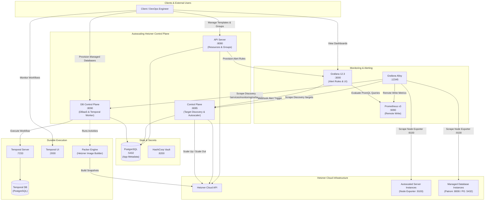
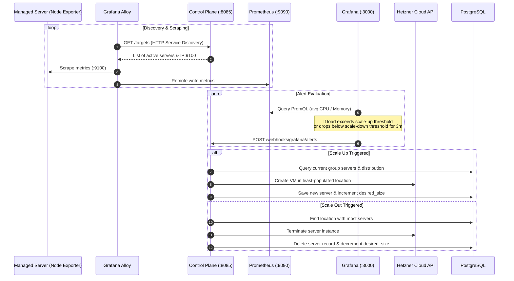
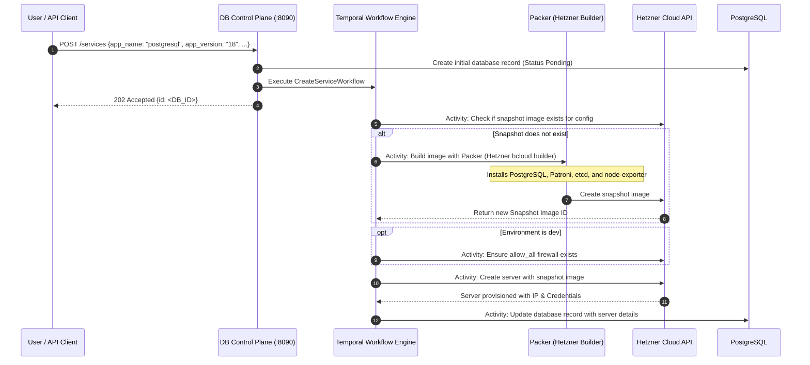

# Autoscaling Hetzner & Cloud Control Plane

A modular, production-ready control plane for **Hetzner Cloud** that combines automated virtual machine autoscaling, cloud resource orchestration, and a **Database-as-a-Service (DBaaS)** provisioning pipeline.

---

## Table of Contents

- [Overview](#overview)
- [System Architecture](#system-architecture)
  - [Core Services](#core-services)
  - [Architecture Diagram](#architecture-diagram)
- [Key Workflows](#key-workflows)
  - [1. Autoscaling & Telemetry Feedback Loop](#1-autoscaling--telemetry-feedback-loop)
  - [2. Managed Database Provisioning Pipeline](#2-managed-database-provisioning-pipeline)
- [Service Ports & Components Matrix](#service-ports--components-matrix)
- [Prerequisites & Environment Configuration](#prerequisites--environment-configuration)
  - [Environment Modes (`prod` vs `dev`)](#environment-modes-prod-vs-dev)
  - [Configuration File (`.env.compose`)](#configuration-file-envcompose)
- [Quick Start Guide](#quick-start-guide)
- [Complete REST API Reference](#complete-rest-api-reference)
  - [API Server (Port 8080)](#api-server-port-8080)
  - [Control Plane (Port 8085)](#control-plane-port-8085)
  - [Database Control Plane (Port 8090)](#database-control-plane-port-8090)
- [Autoscaling & Balancing Mechanics](#autoscaling--balancing-mechanics)
- [Recommended Pictures & Diagrams](#recommended-pictures--diagrams)

---

## Overview

Managing scalable infrastructure on Hetzner Cloud often requires bridging the gap between raw compute instances and enterprise autoscaling primitives. This project provides:

1. **Horizontal VM Autoscaling**: Dynamically scales servers up or down across multiple Hetzner datacenters based on real-time CPU and Memory telemetry from Prometheus and Grafana alerts.
2. **Balanced Multi-Datacenter Distribution**: Automatically balances server placement across selected datacenter locations during scale-up and prioritizes densely populated locations during scale-out.
3. **Database-as-a-Service (DBaaS)**: Uses **Temporal** durable execution workflows and **HashiCorp Packer** to bake custom, production-hardened OS images (e.g. PostgreSQL with Patroni HA and etcd) and deploy them on-demand.
4. **End-to-End Observability**: Auto-provisions Grafana data sources, contact points, and alert rules upon autoscaling group creation, backed by **Grafana Alloy** dynamic HTTP service discovery.

---

## System Architecture

The system is decoupled into three primary microservices, a shared Go module library, and supporting containerized infrastructure:

### Core Services

- **`api-server`** (Port `8080`):
  - Primary RESTful API gateway for managing infrastructure resources (templates, autoscaling groups, networks, firewalls, SSH keys, server instances, and images).
  - Handles initial instance provisioning and automatically sets up Grafana alert rules when an autoscaling group is created.
- **`control-plane`** (Port `8085`):
  - The autoscaling decision and actuation engine.
  - Exposes `/targets` for dynamic HTTP service discovery consumed by Grafana Alloy.
  - Receives Grafana Alerting webhooks at `/webhooks/grafana/alerts` and executes balanced scale-up or scale-out actions against Hetzner Cloud.
- **`db-control-plane`** (Port `8090`):
  - Database and managed service control plane.
  - Coordinates with a **Temporal** workflow engine to orchestrate image verification, automated Packer image baking (Hetzner snapshots), firewall configuration, and VM deployment.
  - Exposes `/services/monitoring/os/targets` for Alloy to scrape database node metrics.
- **`modules/`**:
  - Shared Go modules providing database connection pools (`database`), Hetzner Cloud client setup (`hetzner`), Grafana API provisioning (`grafana`), domain data models (`model`), and autoscaling algorithms (`services`).

### Architecture Diagram



---

## Key Workflows

### 1. Autoscaling & Telemetry Feedback Loop

The autoscaling mechanism continuously monitors system load and acts automatically when configured thresholds are violated:



### 2. Managed Database Provisioning Pipeline

Database provisioning is executed as a fault-tolerant **Temporal Workflow** (`CreateServiceWorkflow`):



---

## Service Ports & Components Matrix

| Service | Container Port | Host Port | Purpose | Default Credentials / URL |
| :--- | :--- | :--- | :--- | :--- |
| **`api-server`** | `8080` | `8080` | Infrastructure & Autoscaling Group API | `http://localhost:8080` |
| **`control-plane`** | `8085` | `8085` | Webhook receiver & Alloy target discovery | `http://localhost:8085` |
| **`db-control-plane`** | `8090` | `8090` | Managed DBaaS & Temporal Worker | `http://localhost:8090` |
| **`grafana`** | `3000` | `3000` | Dashboards, alert rules & webhook triggers | `admin` / `admin` (`http://localhost:3000`) |
| **`prometheus`** | `9090` | `9090` | Time-series metrics backend (`remote_write` enabled) | `http://localhost:9090` |
| **`db`** | `5432` | `5432` | Metadata PostgreSQL database | `postgres` / `1234` |
| **`temporal`** | `7233` | `7233` | Temporal gRPC workflow server | `localhost:7233` |
| **`temporal-ui`** | `8080` | `2000` | Temporal Web UI for monitoring workflows | `http://localhost:2000` |
| **`alloy`** | `12345` | `12345` | Grafana Alloy metrics collector & scraper | `http://localhost:12345` |
| **`vault`** | `8200` | `8200` | HashiCorp Vault for secrets management | `http://localhost:8200` |

---

## Prerequisites & Environment Configuration

- **Docker** and **Docker Compose** installed.
- A valid **Hetzner Cloud API Token** (`HKEY`) with read/write permissions.
- Outbound internet connectivity to reach `api.hetzner.cloud`.

### Environment Modes (`prod` vs `dev`)

The system supports two execution environments configured via the `ENV` variable:

| Feature | `ENV=prod` (Recommended for Hetzner) | `ENV=dev` (Local Testing) |
| :--- | :--- | :--- |
| **Scraping Target IP** | Uses Hetzner private network IP (`res.Server.PrivateNet[0].IP`). | Uses public IPv4 (`res.Server.PublicNet.IPv4.IP`). |
| **Network Requirements** | Control plane must be inside the same Hetzner private network. | Control plane can run locally or outside Hetzner. |
| **Template Public IPs** | Optional; instances can operate purely on private networks. | `publicIPv4` must be enabled. |
| **Firewall Provisioning** | Uses firewalls specified in templates. | Automatically creates and attaches an `allow_all` firewall. |

### Configuration File (`.env.compose`)

Create a `.env.compose` file in the project root:

```bash
# Required Hetzner Cloud API Token
HKEY=your_hetzner_api_token_here

# Deployment mode: 'prod' or 'dev'
ENV=dev

# Optional Hetzner Private Network ID (required if using private networks)
network=12345678
```

The Docker Compose setup maps database hosts and internal networking automatically:
- `DATABASE_HOST=db`
- `GRAFANA_HOST=grafana:3000`
- `CONTROLLER_HOST=control-plane`
- `CONTROLLER_PORT=8085`
- `TEMPORAL_ADDRESS=temporal:7233`
- `BUILD_TARGET=hetzner`
- `PACKER_TEMPLATES_PATH=/packer-templates`

---

## Quick Start Guide

### 1. Clone the Repository

```bash
git clone https://github.com/ahmedhesham301/autoscaling-hetzner.git
cd autoscaling-hetzner
```

### 2. Configure Environment

```bash
cp .env.compose.example .env.compose # or edit directly
```

Ensure your `HKEY` is set in `.env.compose`.

### 3. Launch All Services

```bash
docker compose up -d --build
```

### 4. Automated Startup & Health Checks

When Docker Compose starts:
1. PostgreSQL initializes tables using `configs/schema.sql`.
2. `temporal-postgresql` starts and `temporal-admin-tools` executes `scripts/temporal/setup-postgres.sh` to initialize schemas.
3. `temporal-create-namespace` runs `scripts/temporal/create-namespace.sh` to ensure the `default` namespace is ready.
4. `api-server` automatically verifies database connectivity, sets up the Grafana Prometheus datasource, ensures the `alerts` folder exists, and registers the `server` webhook contact point.
5. Grafana Alloy begins polling `/targets` and `/services/monitoring/os/targets`.

---

## Complete REST API Reference

### API Server (Port 8080)

Base URL: `http://localhost:8080`

#### 1. Discovery & Cloud Resources

| Method | Endpoint | Description |
| :--- | :--- | :--- |
| `GET` | `/locations` | List available Hetzner locations (e.g. `fsn1`, `nbg1`, `hel1`). |
| `GET` | `/server_types` | List available Hetzner server types (e.g. `cx23`, `cpx31`). |
| `GET` | `/images` | List available OS and snapshot images. |
| `GET` | `/images/:id` | Get image details by ID. |
| `DELETE`| `/images/:id` | Delete an image by ID. |

#### 2. Network & Security Management

| Method | Endpoint | Description |
| :--- | :--- | :--- |
| `GET` | `/networks` | List private networks. |
| `GET` | `/networks/:id` | Get network details by ID. |
| `POST` | `/networks` | Create a new private network. |
| `DELETE`| `/networks/:id` | Delete a private network. |
| `GET` | `/firewalls` | List firewalls. |
| `GET` | `/firewalls/:id` | Get firewall by ID. |
| `POST` | `/firewalls` | Create a firewall. |
| `DELETE`| `/firewalls/:id` | Delete a firewall. |
| `GET` | `/ssh_keys` | List SSH keys. |
| `GET` | `/ssh_keys/:id` | Get SSH key by ID. |
| `POST` | `/ssh_keys` | Upload an SSH key (`name`, `public_key`). |
| `DELETE`| `/ssh_keys/:id` | Delete an SSH key. |

#### 3. Server Templates

Templates define how servers inside an autoscaling group are provisioned.

- `POST /templates`
- `GET /templates`
- `GET /templates/:id`

**Request Body (`POST /templates`):**

```json
{
  "image_id": 310554929,
  "networks": [11952339],
  "SSH_keys": [107916411],
  "firewalls": [12345],
  "publicIPv4": true,
  "publicIPv6": true,
  "cloudConfig": "#cloud-config\npackage_update: true\npackage_upgrade: true\npackages:\n  - prometheus-node-exporter\n  - stress"
}
```

#### 4. Autoscaling Groups

Creating an autoscaling group immediately provisions `desiredSize` instances, balances them across `locations`, saves them to the database, and registers a Grafana Alert Rule.

- `POST /groups`
- `GET /groups`
- `GET /groups/:id`
- `DELETE /groups/:id` *(Terminates all group VMs, removes DB records, and deletes Grafana alert rule)*

**Request Body (`POST /groups`):**

```json
{
  "templateId": 1,
  "name": "web-cluster",
  "zone": "eu-central",
  "locations": [2, 3],
  "serverType": "cx23",
  "minSize": 1,
  "desiredSize": 2,
  "maxSize": 5,
  "monitoringType": "cpu",
  "scalingAlgorithm": "simple",
  "scaleUpThreshold": 75,
  "scaleDownThreshold": 35
}
```

*Parameters:*
- `monitoringType`: `"cpu"` or `"memory"`.
- `scalingAlgorithm`: `"simple"` (uses `scaleUpThreshold` and `scaleDownThreshold`).
- `scaleUpThreshold` / `scaleDownThreshold`: Utilization percentages (1–100).
- `locations`: Array of Hetzner location IDs to balance across.

#### 5. Standalone Servers

- `GET /servers`: List all servers.
- `GET /servers/:id`: Get server details.
- `POST /servers`: Create a standalone server.
- `DELETE /servers/:id`: Delete a standalone server.

---

### Control Plane (Port 8085)

Base URL: `http://localhost:8085`

| Method | Endpoint | Description |
| :--- | :--- | :--- |
| `GET` | `/targets` | HTTP Service Discovery endpoint scraped by Grafana Alloy. Returns all managed instances with label `groupId`. |
| `POST` | `/webhooks/grafana/alerts` | Webhook receiver invoked by Grafana Alerting. Evaluates alert state and executes `ScaleUp` or `ScaleOut`. |

---

### Database Control Plane (Port 8090)

Base URL: `http://localhost:8090`

| Method | Endpoint | Description |
| :--- | :--- | :--- |
| `GET` | `/services` | List available database templates from `packer-templates` (e.g. `["postgresql"]`). |
| `GET` | `/services/:kind` | Get schema and configurable options for a service (e.g. `/services/postgresql`). |
| `POST` | `/services` | Trigger a Temporal workflow to build and deploy a managed database. |
| `GET` | `/services/monitoring/os/targets` | Scrape target endpoint for database OS metrics consumed by Alloy. |

**Request Body (`POST /services`):**

```json
{
  "app_name": "postgresql",
  "app_version": "18",
  "location": "nbg1",
  "server_type": "cx23",
  "public_ipv4": true,
  "public_ipv6": true,
  "node_exporter": true,
  "service_exporter": true,
  "network_id": 12633796,
  "extra_labels": {
    "environment": "production"
  }
}
```

---

## Autoscaling & Balancing Mechanics

### Multi-Datacenter Balancing

- **Scale Up Placement (`whereToScaleUp`)**:
  1. Checks if any location in `group.Locations` has zero running instances; if found, places the new VM there.
  2. Otherwise, identifies the location with the minimum number of active servers and schedules the instance there.
- **Scale Out Placement (`ScaleOut`)**:
  1. Queries all servers across locations.
  2. Identifies the location with the highest instance count and terminates the oldest server in that location, maintaining parity across datacenters.

### PromQL Alert Expressions

Grafana alert rules are dynamically configured during group creation:

- **CPU Monitoring**:
  ```promql
  avg(1 - rate(node_cpu_seconds_total{mode="idle", groupId="<GROUP_ID>"}[1m])) * 100
  ```
- **Memory Monitoring**:
  ```promql
  (1 - (node_memory_MemAvailable_bytes{groupId="<GROUP_ID>"} / node_memory_MemTotal_bytes{groupId="<GROUP_ID>"})) * 100
  ```

Alert rules evaluate every **3 minutes** (`For: 3m`, `RepeatInterval: 3m`) to prevent flapping.

---

## Recommended Pictures & Diagrams

To make this documentation visually complete, the following diagrams and screenshots should be placed in a `docs/images/` directory:

```
docs/
└── images/
    ├── architecture.png        <-- High-level system infographic
    ├── autoscaling-flow.png    <-- Visual workflow diagram
    ├── grafana-dashboard.png   <-- Screenshot of Grafana autoscaling dashboard
    └── temporal-workflow.png   <-- Screenshot of Temporal UI execution
```

### 1. Updated Architecture Infographic (`docs/images/architecture.png`)
- **Current State**: The legacy image embedded in earlier versions showed a single monolithic Go server.
- **What is needed**: An updated visual diagram illustrating the 3 distinct microservices (`api-server:8080`, `control-plane:8085`, `db-control-plane:8090`), the Temporal workflow engine, Packer image builds, and the Grafana/Alloy/Prometheus monitoring loop.

### 2. Live Grafana Dashboard Screenshot (`docs/images/grafana-dashboard.png`)
- **What is needed**: A screenshot showing a Grafana dashboard displaying:
  - Average CPU and Memory utilization graphs grouped by `groupId`.
  - Configured scale-up and scale-down threshold threshold lines.
  - An active firing alert state transitioning into the webhook trigger.

### 3. Temporal Workflow Execution Screenshot (`docs/images/temporal-workflow.png`)
- **What is needed**: A screenshot of the **Temporal Web UI** (`http://localhost:2000`) showing a completed `CreateServiceWorkflow` execution with its activity timeline (`checkImageExist` $\rightarrow$ `buildImage` $\rightarrow$ `deployDB`).
