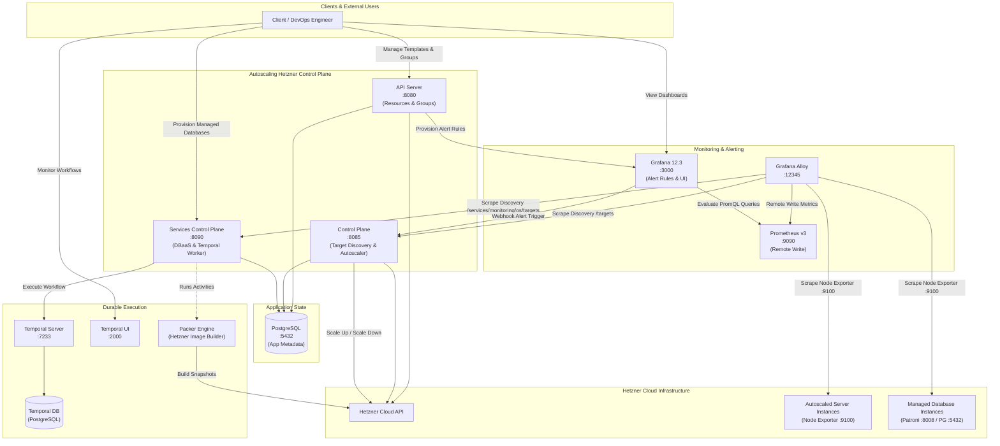
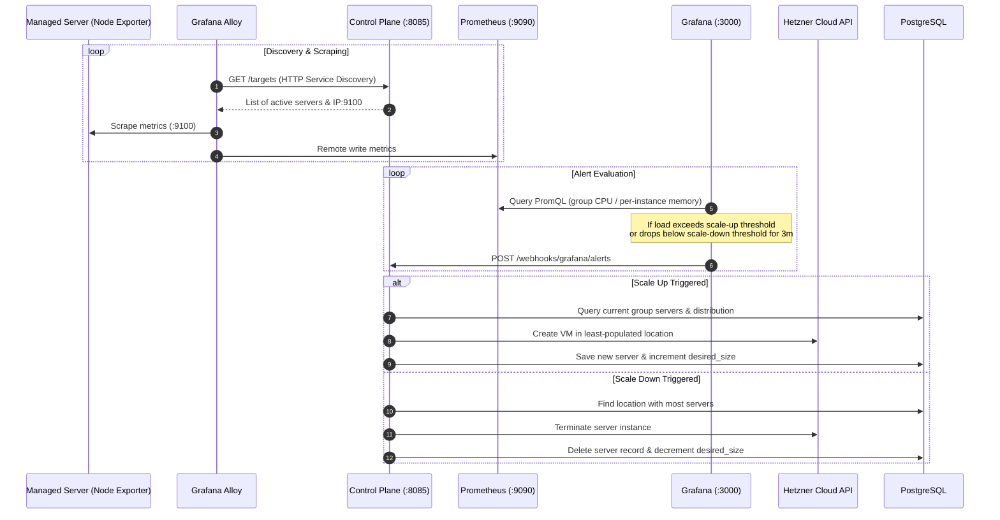
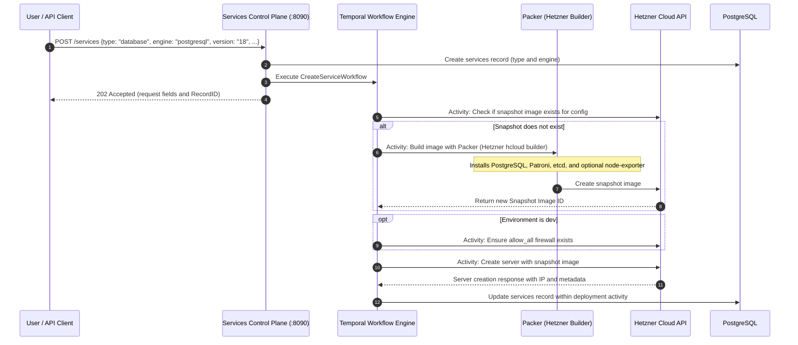

# Autoscaling Hetzner & Cloud Control Plane

An experimental, modular control plane for **Hetzner Cloud** that combines automated virtual machine autoscaling, cloud resource orchestration, and a **Database-as-a-Service (DBaaS)** provisioning pipeline.

---

## Table of Contents

- [Overview](#overview)
- [System Architecture](#system-architecture)
  - [Core Services](#core-services)
  - [Architecture Diagram](#architecture-diagram)
- [Repository Layout & Data Model](#repository-layout--data-model)
- [Key Workflows](#key-workflows)
  - [1. Autoscaling & Telemetry Feedback Loop](#1-autoscaling--telemetry-feedback-loop)
  - [2. Managed Database Provisioning Pipeline](#2-managed-database-provisioning-pipeline)
- [Service Ports & Components Matrix](#service-ports--components-matrix)
- [Prerequisites & Environment Configuration](#prerequisites--environment-configuration)
  - [Environment Modes (`prod` vs `dev`)](#environment-modes-prod-vs-dev)
  - [Configuration File (`.env.compose`)](#configuration-file-envcompose)
- [Quick Start Guide](#quick-start-guide)
- [REST API Reference](#rest-api-reference)
  - [API Server (Port 8080)](#api-server-port-8080)
  - [Control Plane (Port 8085)](#control-plane-port-8085)
  - [Services Control Plane (Port 8090)](#services-control-plane-port-8090)
- [Packer Image Builds](#packer-image-builds)
- [Autoscaling & Balancing Mechanics](#autoscaling--balancing-mechanics)
- [Current Limitations](#current-limitations)
- [Development Checks](#development-checks)

---

## Overview

This repository implements VM autoscaling and a single-node PostgreSQL provisioning pipeline. The current capabilities are:

1. **Horizontal VM Autoscaling**: Dynamically scales servers up or down across multiple Hetzner datacenters based on real-time CPU and Memory telemetry from Prometheus and Grafana alerts.
2. **Balanced Multi-Datacenter Distribution**: Automatically balances server placement across selected datacenter locations during scale-up and prioritizes densely populated locations during scale-down.
3. **Database-as-a-Service (DBaaS)**: Uses **Temporal** workflows and **HashiCorp Packer** to build OS images containing PostgreSQL, Patroni, and local etcd, then deploy them on demand.
4. **End-to-End Observability**: Provisions a Prometheus datasource through Compose, initializes Grafana contact points at API startup, and creates alert rules during group creation, backed by **Grafana Alloy** dynamic HTTP service discovery.

---

## System Architecture

The system is decoupled into three primary microservices, a shared Go module library, and supporting containerized infrastructure:

### Core Services

- **`api-server`** (Port `8080`):
  - Primary RESTful API gateway for managing infrastructure resources (templates, autoscaling groups, networks, firewalls, SSH keys, server instances, and images).
  - Handles initial instance provisioning and automatically sets up Grafana alert rules when an autoscaling group is created.
- **`control-plane`** (Port `8085`):
  - The autoscaling decision and actuation engine.
  - Exposes `/targets` for dynamic HTTP service discovery consumed by Grafana Alloy.
  - Receives Grafana Alerting webhooks at `/webhooks/grafana/alerts` and executes balanced scale-up or scale-down actions against Hetzner Cloud.
- **`services-control-plane`** (Port `8090`, Compose service key `db-control-plane`):
  - Database and managed service control plane.
  - Coordinates with a **Temporal** workflow engine to orchestrate image verification, automated Packer image baking (Hetzner snapshots), firewall configuration, and VM deployment.
  - Exposes `/services/monitoring/os/targets` for Alloy to scrape database node metrics.
  - Currently accepts only service type `database` and engine `postgresql`. Template discovery has not yet been adapted to the nested template directories (see the API reference).
- **`modules/`**:
  - Shared Go modules providing database connection pools (`database`), Hetzner Cloud client setup (`hetzner`), Grafana API provisioning (`grafana`), domain data models (`model`), and autoscaling algorithms (`services`).

### Architecture Diagram



---

## Repository Layout & Data Model

```text
api-server/                         Infrastructure REST API
control-plane/                      Grafana webhooks and group target discovery
services-control-plane/             Service API, validation, Temporal worker and activities
modules/                            Shared cloud clients, models and scaling logic
configs/schema.sql                  Application PostgreSQL schema
configs/alloy/                      Discovery, scraping and Prometheus remote write
configs/grafana/                    Prometheus datasource provisioning
configs/temporal/                   Dynamic configuration (currently empty)
packer-templates/database/postgresql/  Packer definition, installer and Patroni config
packer-templates/common/            Shared image setup, cleanup and cloud-init files
scripts/temporal/                   Temporal schema and namespace initialization
.github/workflows/                  Container publishing and security scans
docker-compose.yaml                 Local stack and service dependencies
go.work                             Four-module Go workspace
```

The application database contains four tables:

| Table | Stored state |
| :---- | :----------- |
| `templates` | Image, networks, SSH keys, firewalls, public IP flags and cloud-config for group VMs. |
| `groups` | Template reference, locations, instance sizes and monitoring/scaling thresholds. |
| `servers` | Hetzner IDs and metadata for group VMs, linked to `groups`. |
| `services` | Service type and engine, followed by VM metadata and exporter flags after deployment. |

The `private_ip` columns store public IPv4 addresses in development mode. Standalone servers created through `/servers` are not recorded in these tables. Temporal uses a separate PostgreSQL container with `temporal` and `temporal_visibility` databases.

## Key Workflows

### 1. Autoscaling & Telemetry Feedback Loop

The autoscaling mechanism continuously monitors system load and acts automatically when configured thresholds are violated:



### 2. Managed Database Provisioning Pipeline

Database provisioning runs through **Temporal Workflow** `CreateServiceWorkflow`. Activities can retry, but resource creation is not yet idempotent; retries after partial failures can create duplicate resources.



---

## Service Ports & Components Matrix

| Service                | Container Port | Host Port | Purpose                                              | Default Credentials / URL                   |
| :--------------------- | :------------- | :-------- | :--------------------------------------------------- | :------------------------------------------ |
| **`api-server`**       | `8080`         | `8080`    | Infrastructure & Autoscaling Group API               | `http://localhost:8080`                     |
| **`control-plane`**    | `8085`         | `8085`    | Webhook receiver & Alloy target discovery            | `http://localhost:8085`                     |
| **`db-control-plane`** | `8090`         | `8090`    | Services API & Temporal worker; container name `services-control-plane` | `http://localhost:8090`                     |
| **`grafana`**          | `3000`         | `3000`    | Dashboards, alert rules & webhook triggers           | `admin` / `admin` (`http://localhost:3000`) |
| **`prometheus`**       | `9090`         | `9090`    | Time-series metrics backend (`remote_write` enabled) | `http://localhost:9090`                     |
| **`db`**               | `5432`         | `5432`    | Metadata PostgreSQL database                         | `postgres` / `1234`                         |
| **`temporal`**         | `7233`         | `7233`    | Temporal gRPC workflow server                        | `localhost:7233`                            |
| **`temporal-ui`**      | `8080`         | `2000`    | Temporal Web UI for monitoring workflows             | `http://localhost:2000`                     |
| **`alloy`**            | `12345`        | `12345`   | Grafana Alloy metrics collector & scraper            | `http://localhost:12345`                    |
| **`vault`**            | `8200`         | `8200`    | Included in Compose; not integrated with the application | `http://localhost:8200`                     |

---

## Prerequisites & Environment Configuration

- **Docker** and **Docker Compose** installed.
- A valid **Hetzner Cloud API Token** (`HKEY`) with read/write permissions.
- Outbound connectivity for Hetzner, container registries, and image-build package downloads.
- Capacity and quota for billable VMs and snapshots, including temporary Packer build VMs.

### Environment Modes (`prod` vs `dev`)

The system supports two execution environments configured via the `ENV` variable:

| Feature | `ENV=prod` (Private-network mode) | `ENV=dev` (Local Testing) |
| :------------------------ | :--------------------------------------------------------------- | :---------------------------------------------------------- |
| **Scraping Target IP** | Uses Hetzner private network IP (`res.Server.PrivateNet[0].IP`). | Uses public IPv4 (`res.Server.PublicNet.IPv4.IP`). |
| **Network Requirements** | Alloy must have connectivity to the VMs' private network. | Alloy must be able to reach the VMs' public IPv4 addresses. |
| **Template Public IPs** | Optional; instances can operate purely on private networks. | `publicIPv4` must be enabled. |
| **Group Firewalls** | Uses template `firewalls`. | Uses template `firewalls`; no automatic firewall is added. |
| **Service Firewalls** | Applies request `firewalls_ids`. | Applies request firewalls and appends `allow_all` for all IPv4 TCP traffic; forces public IPv4/IPv6 on. |

### Configuration File (`.env.compose`)

Create a `.env.compose` file in the project root:

```bash
# Required Hetzner Cloud API Token
HKEY=your_hetzner_api_token_here

# Deployment mode: 'prod' or 'dev'
ENV=dev

# Required existing Hetzner network ID; replace this example value.
networkID=12345678
```

The services control plane requires `networkID` at startup and parses it as an integer for every provisioning request. Packer attaches its build VM to this network. A deployed service joins the same network when its request sets `network.private_network=true`; there is no per-request network ID. Group templates use their own `networks` array. Choose a network compatible with the Packer build location (`nbg1`) and deployed service location.

Only the exact value `ENV=dev` selects public-IP discovery. Every other value selects the first private IP, so group templates must include a network and service requests must enable `network.private_network`. Alloy must be able to reach the selected addresses.

Docker Compose supplies these service settings:

- `DATABASE_HOST=db`
- `GRAFANA_HOST=grafana:3000`
- `CONTROLLER_HOST=control-plane`
- `CONTROLLER_PORT=8085`
- `TEMPORAL_ADDRESS=temporal:7233`
- `BUILD_TARGET=hetzner`
- `PACKER_TEMPLATES_PATH=/packer-templates`

`BUILD_TARGET` is checked by the services process and read by Packer; `hetzner` is the configured build path. The applications read process environment variables directly and do not load `.env` themselves. Compose explicitly loads `.env.compose` into the three Go services. `api-server/.env.example` is incomplete and does not replace the configuration above.

---

## Quick Start Guide

### 1. Clone the Repository

```bash
git clone https://github.com/ahmedhesham301/autoscaling-hetzner.git
cd autoscaling-hetzner
```

### 2. Configure Environment

Create `.env.compose` using the example above and replace the `HKEY` and `networkID` placeholders. There is currently no root `.env.compose.example` file.

The APIs have no authentication and Compose publishes ports on all host interfaces. Use an isolated development environment; restrict published ports before starting the stack. Database images also contain a shared password (see [Current Limitations](#current-limitations)).

Alloy currently uses `172.17.0.1` to reach the host. For communication within this Compose stack, change the discovery URL in `configs/alloy/main.alloy` to `http://control-plane:8085/targets` and set Alloy’s `DB_CONTROL_PLANE_HOST` in `docker-compose.yaml` to `db-control-plane`. The `DATABASE_OS_TARGETS` environment variable is unused.

### 3. Launch All Services

```bash
docker compose config --quiet
docker compose up -d --build
```

Compose commands use the service key `db-control-plane`, even though the source directory, container name and published image use `services-control-plane`. Docker builds use the repository root as their context so the Go workspace resolves the shared local module. Packer templates are mounted separately into the services container, read-only.

### 4. Automated Startup & Health Checks

When Docker Compose starts:

1. PostgreSQL initializes tables using `configs/schema.sql` when its data directory is empty. This is not a migration mechanism for existing databases.
2. `temporal-postgresql` starts and `temporal-admin-tools` executes `scripts/temporal/setup-postgres.sh` to initialize schemas.
3. `temporal-create-namespace` runs `scripts/temporal/create-namespace.sh` to ensure the `default` namespace is ready.
4. Grafana loads the Prometheus datasource from `configs/grafana/datasource.yaml`. The API verifies database connectivity, reads the first Grafana datasource, initializes an alert folder, and registers the `server` webhook contact point if absent.
5. Grafana Alloy polls `/targets` and `/services/monitoring/os/targets` and scrapes discovered node exporters every 30 seconds.

Compose does not currently wait for Grafana readiness before starting the API, or namespace creation before starting the services worker. The services process initializes its Temporal client, database pool and Hetzner client before starting the worker. Check startup logs before submitting requests:

```bash
docker compose ps -a
docker compose logs --tail=100 api-server db-control-plane temporal-create-namespace
curl --fail http://localhost:8080/templates
curl --fail http://localhost:8090/services
```

Confirm namespace initialization completed successfully in its logs. These GET requests check API reachability; they do not validate provisioning or database readiness.

---

## REST API Reference

### API Server (Port 8080)

Base URL: `http://localhost:8080`

#### 1. Discovery & Cloud Resources

| Method   | Endpoint        | Description                                                     |
| :------- | :-------------- | :-------------------------------------------------------------- |
| `GET`    | `/locations`    | List available Hetzner locations (e.g. `fsn1`, `nbg1`, `hel1`). |
| `GET`    | `/server_types` | List available Hetzner server types (e.g. `cx23`, `cpx31`).     |
| `GET`    | `/images`       | List available OS and snapshot images.                          |
| `GET`    | `/images/:id`   | Get image details by ID.                                        |
| `DELETE` | `/images/:id`   | Delete an image by ID.                                          |

#### 2. Network & Security Management

| Method   | Endpoint         | Description                               |
| :------- | :--------------- | :---------------------------------------- |
| `GET`    | `/networks`      | List private networks.                    |
| `GET`    | `/networks/:id`  | Get network details by ID.                |
| `POST`   | `/networks`      | Create a new private network.             |
| `DELETE` | `/networks/:id`  | Delete a private network.                 |
| `GET`    | `/firewalls`     | List firewalls.                           |
| `GET`    | `/firewalls/:id` | Get firewall by ID.                       |
| `POST`   | `/firewalls`     | Create a firewall.                        |
| `DELETE` | `/firewalls/:id` | Delete a firewall.                        |
| `GET`    | `/ssh_keys`      | List SSH keys.                            |
| `GET`    | `/ssh_keys/:id`  | Get SSH key by ID.                        |
| `POST`   | `/ssh_keys`      | Upload an SSH key (`name`, `public_key`). |
| `DELETE` | `/ssh_keys/:id`  | Delete an SSH key.                        |

#### 3. Server Templates

Templates define how servers inside an autoscaling group are provisioned. Replace all resource IDs in the examples with IDs from your Hetzner project. Install and enable node exporter in the image or cloud config, and allow Alloy to reach TCP port 9100.

- `POST /templates`
- `GET /templates`
- `GET /templates/:id`

**Request Body (`POST /templates`):**

```json
{
  "image_id": 310554929,
  "networks": [11952339],
  "SSH_keys": [107916411],
  "firewalls": [12345],
  "publicIPv4": true,
  "publicIPv6": true,
  "cloudConfig": "#cloud-config\npackage_update: true\npackage_upgrade: true\npackages:\n  - prometheus-node-exporter\n  - stress"
}
```

#### 4. Autoscaling Groups

Group creation synchronously saves the group, attempts to provision `desiredSize` instances across `locations`, saves the servers, and registers a Grafana alert rule. Success returns HTTP 200 with no response body; use `GET /groups` to retrieve the group. Partial failures are not rolled back.

Currently, `desiredSize >= maxSize` returns without provisioning any instances or alert rule. Use positive sizes with `minSize <= desiredSize < maxSize` until this bug is fixed.

- `POST /groups`
- `GET /groups`
- `GET /groups/:id`
- `DELETE /groups/:id` _(Terminates all group VMs, removes DB records, and deletes Grafana alert rule)_

**Request Body (`POST /groups`):**

```json
{
  "templateId": 1,
  "name": "web-cluster",
  "zone": "eu-central",
  "locations": [2, 3],
  "serverType": "cx23",
  "minSize": 1,
  "desiredSize": 2,
  "maxSize": 5,
  "monitoringType": "cpu",
  "scalingAlgorithm": "simple",
  "scaleUpThreshold": 75,
  "scaleDownThreshold": 35
}
```

_Parameters:_

- `monitoringType`: `"cpu"` or `"memory"`.
- `scalingAlgorithm`: `"simple"` (uses `scaleUpThreshold` and `scaleDownThreshold`).
- `scaleUpThreshold` / `scaleDownThreshold`: Utilization percentages (1–100), with the lower threshold strictly below the upper threshold.
- `locations`: A nonempty array of Hetzner location IDs to balance across.
- `zone`: Required and stored, but not used to enforce placement.
- `scalingAlgorithm="target"`: Accepted by the SQL enum but not implemented by alert setup or the webhook handler; use `"simple"`.

#### 5. Standalone Servers

- `GET /servers`: List all servers.
- `GET /servers/:id`: Get server details.
- `POST /servers`: Create a standalone server.
- `DELETE /servers/:id`: Delete a server directly in Hetzner.

These endpoints operate on project servers, including group-managed servers. Direct deletion does not update group metadata or desired size. Use group operations for managed resources.

---

### Control Plane (Port 8085)

Base URL: `http://localhost:8085`

| Method | Endpoint                   | Description                                                                                                   |
| :----- | :------------------------- | :------------------------------------------------------------------------------------------------------------ |
| `GET`  | `/targets`                 | HTTP Service Discovery endpoint scraped by Grafana Alloy. Returns recorded autoscaling-group instances with label `groupId`. |
| `POST` | `/webhooks/grafana/alerts` | Webhook receiver invoked by Grafana Alerting. Evaluates alert state and executes `ScaleUp` or `ScaleOut`.     |

---

### Services Control Plane (Port 8090)

Base URL: `http://localhost:8090`

| Method | Endpoint                          | Description                                                                        |
| :----- | :-------------------------------- | :--------------------------------------------------------------------------------- |
| `GET`  | `/services`                       | Lists non-hidden entries immediately under `PACKER_TEMPLATES_PATH`; currently `["common", "database"]`. |
| `GET`  | `/services/:kind`                 | Reads `<templates-path>/<kind>/info.json`; currently fails for PostgreSQL because its metadata is nested under `database/postgresql/`. |
| `POST` | `/services`                       | Trigger a Temporal workflow to build and deploy a managed database.                |
| `GET`  | `/services/monitoring/os/targets` | Scrape target endpoint for database OS metrics consumed by Alloy.                  |

**Request Body (`POST /services`):**

```json
{
  "type": "database",
  "engine": "postgresql",
  "version": "18",
  "location": "nbg1",
  "server_type": "cx23",
  "firewalls_ids": [],
  "network": {
    "public_ipv4": true,
    "public_ipv6": true,
    "private_network": false
  },
  "monitoring": {
    "node_exporter": true,
    "service_exporter": false
  }
}
```

A successful submission returns HTTP 202 with the bound request fields and a capitalized `RecordID` field (for example, `"RecordID": 1`). Omitted pointer fields such as `config` and `extra_labels` serialize as `null`. Track execution in Temporal UI using workflow ID `create-database-workflow1` for record 1. The worker uses task queue `task-queue`, and each activity has a 15-minute start-to-close timeout.

Acceptance does not mean the database is ready: the workflow stores VM metadata without checking PostgreSQL health. There is no service-instance listing, status, deletion, or credential-retrieval endpoint. `GET /services` lists filesystem entries only; its discovery limitation does not prevent submitting the request above directly.

- `type` and `engine`: Only `database` / `postgresql` pass validation.
- `version`: Passed to the installer without version validation; use `18` because Patroni's binary path is fixed to that version.
- `network`: Validation requires `public_ipv4` or `private_network` to be true, including in development mode. IPv6 alone does not pass validation. `private_network=true` attaches the VM to the environment's `networkID`.
- `monitoring.node_exporter`: Controls node exporter installation and OS target discovery on port 9100. Discovery labels are `server_name`, `server_id`, `type` and `engine`.
- `monitoring.service_exporter`: Used in image labels and stored in metadata, but no database exporter is installed or scraped.
- `firewalls_ids`: Applies the supplied Hetzner firewall IDs. In development mode the workflow also attaches `allow_all`; this added firewall is not included in the stored request firewall list.
- `config` and `extra_labels`: Accepted but currently unused for image building or server configuration.

The old flat fields `app_name`, `app_version`, `network_id`, `node_exporter` and `firewall_id` are not the current creation contract. See [CreateServiceParams](services-control-plane/data/data.go) for the request structure. The existing `info.json` still uses the earlier `app_name` / `app_version` metadata format.

---

## Packer Image Builds

The workflow searches Hetzner images using the labels `type`, `engine`, `version`, `node_exporter` and `service_exporter`, and reuses the first match. If there is no match, it runs `packer build -machine-readable` on `packer-templates/<type>/<engine>/main.pkr.hcl` and extracts the snapshot ID from Packer's artifact output. Changes to provisioning scripts or Patroni settings do not change these lookup labels, so a matching existing image can retain an older configuration.

The PostgreSQL template builds from `debian-13` using a temporary `cx23` server in `nbg1`, independently of the requested deployed server type and location. Shared scripts upgrade packages, suppress service autostart during installation, optionally install node exporter, and clean cloud-init state, logs, package caches and SSH host keys before the snapshot is taken. The database installer installs PostgreSQL, Patroni and local etcd, drops the default PostgreSQL cluster, and enables Patroni and etcd for boot.

The services container installs Packer and the Hetzner plugin. For a manual build from the repository root, export `HKEY` and use an existing network ID:

```bash
packer init packer-templates/database/postgresql/main.pkr.hcl
packer build \
  -var 'build_target=hetzner' \
  -var 'env=dev' \
  -var 'networkID=12345678' \
  -var 'config={"type":"database","engine":"postgresql","version":"18","node_exporter":true,"service_exporter":false}' \
  packer-templates/database/postgresql/main.pkr.hcl
```

This command creates a temporary cloud VM and a billable snapshot. The `env` Packer variable is passed through but currently does not change provisioning. A Vagrant source is also present in the HCL, but its required-plugin declaration is commented out and the services image installs only the Hetzner plugin; that alternate build path is incomplete.

---

## Autoscaling & Balancing Mechanics

### Multi-Datacenter Balancing

- **Scale Up Placement (`whereToScaleUp`)**:
  1. Checks if any location in `group.Locations` has zero recorded instances; if found, places the new VM there.
  2. Otherwise, identifies the location with the minimum number of recorded servers and schedules the instance there.
- **Scale Down Placement (`ScaleOut` in code)**:
  1. Queries all servers across locations.
  2. Identifies the location with the highest recorded instance count and terminates the first returned server in that location. The SQL query has no ordering, so oldest-first deletion is not guaranteed.

### PromQL Alert Expressions

Grafana alert rules are dynamically configured during group creation:

- **CPU Monitoring**:

  ```promql
  avg(1 - rate(node_cpu_seconds_total{mode="idle", groupId="<GROUP_ID>"}[1m])) * 100
  ```

- **Memory Monitoring**:

  ```promql
  (1 - (node_memory_MemAvailable_bytes{groupId="<GROUP_ID>"} / node_memory_MemTotal_bytes{groupId="<GROUP_ID>"})) * 100
  ```

Rules use a **3-minute pending period** (`For: 3m`) and a **3-minute repeat notification interval** (`RepeatInterval: 3m`). These settings do not set the evaluation frequency; that is controlled by Grafana’s evaluation group. There is no separate controller cooldown or webhook deduplication. The CPU expression aggregates across the group, while the memory expression returns per-instance series.

---

## Current Limitations

- **Access and credentials:** API routes and scaling webhooks have no authentication or resource ownership checks. The metadata database uses `postgres` / `1234`, Grafana client authentication uses `admin` / `admin`, and baked PostgreSQL instances use `master` / `1234`. Patroni listens on port 8008 without configured authentication. Restrict network access and replace these defaults before using sensitive data. Changing container credentials alone is insufficient because application clients also hardcode them. Vault is included in Compose but is not integrated.
- **State and recovery:** Compose does not configure named data volumes for PostgreSQL, Temporal PostgreSQL, or Grafana. Configure persistent storage and backups before relying on their state across teardown/recreation. Cloud creation/deletion and metadata updates are not atomic, and there is no general reconciliation or rollback mechanism. Inspect Hetzner resources after failures to identify orphaned VMs and snapshots. Stopping Compose does not delete cloud resources.
- **Scaling correctness:** Concurrent or repeated alerts can exceed capacity limits or leave incorrect counts. Missing webhook metric `B0` is interpreted as zero and can trigger scale-down. Private-IP selection assumes at least one private network; invalid configurations can panic after VM creation.
- **Database capabilities:** The template deploys one PostgreSQL node with local etcd; multi-node HA, backups, credential generation, and database readiness checks are not implemented. Use version `18`: although template metadata lists other versions, Patroni’s binary directory is fixed to PostgreSQL 18.
- **Service API refactor:** Template discovery still assumes a flat directory layout. Provisioning requires a numeric `networkID` even for a deployment using only public networking; Packer always receives it. The schema now uses `services` with `type` and `engine`; existing installations need a manual schema migration because the initialization SQL only runs on a fresh data directory.
- **Startup:** API startup depends on a reachable Grafana instance with at least one datasource, but Compose only gates it on PostgreSQL. The services worker is not gated on successful Temporal namespace initialization. A metadata record is inserted before network ID parsing and workflow submission, so submission failures can leave incomplete records.

---

## Development Checks

The Go workspace includes `api-server`, `control-plane`, `services-control-plane`, and `modules`, and all manifests currently declare Go `1.27.1`. From the repository root:

```bash
go test ./api-server/... ./control-plane/... ./services-control-plane/... ./modules/...
go vet ./api-server/... ./control-plane/... ./services-control-plane/... ./modules/...
docker compose config --quiet
for script in packer-templates/common/scripts/*.sh packer-templates/database/postgresql/install.sh; do
  bash -n "$script" || exit 1
done
sh -n scripts/temporal/setup-postgres.sh scripts/temporal/create-namespace.sh
packer validate -syntax-only packer-templates/database/postgresql/main.pkr.hcl
```

Compose validation requires `.env.compose`. There are currently no Go test files, so `go test` checks package compilation but provides no behavioral coverage. Packer syntax validation does not check plugin availability or prove that an image can be built. These checks do not create cloud resources or prove that the full provisioning pipeline works.

To run a Go service locally, export its environment variables and use `go run ./api-server`, `go run ./control-plane` or `go run ./services-control-plane` from the repository root. For host processes, use `DATABASE_HOST=localhost`, `GRAFANA_HOST=localhost:3000`, `TEMPORAL_ADDRESS=localhost:7233` and an absolute `PACKER_TEMPLATES_PATH` pointing to this checkout. The services process also needs Packer and its Hetzner plugin on the host. Set `CONTROLLER_HOST` to an address reachable **from Grafana**, since it becomes the webhook URL. Stop the corresponding Compose service first if it is already using that host port.

The three image workflows build and publish Docker Hub images on changes to their service directory or `modules/`, then upload Trivy scan results. They use `DOCKERHUB_USERNAME` and `DOCKERHUB_TOKEN`. The Snyk workflow runs code analysis and dependency monitoring on main-branch pushes, pull requests, manual dispatch and its configured five-minute schedule, using `SNYK_TOKEN`. No workflow currently runs Go tests.
